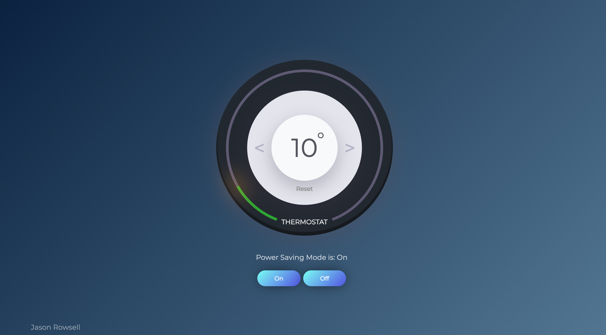
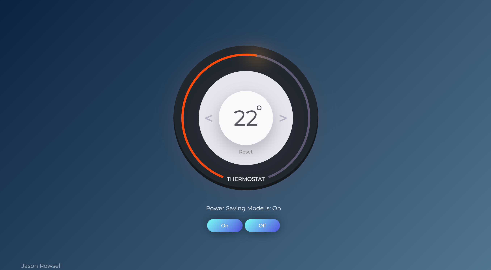
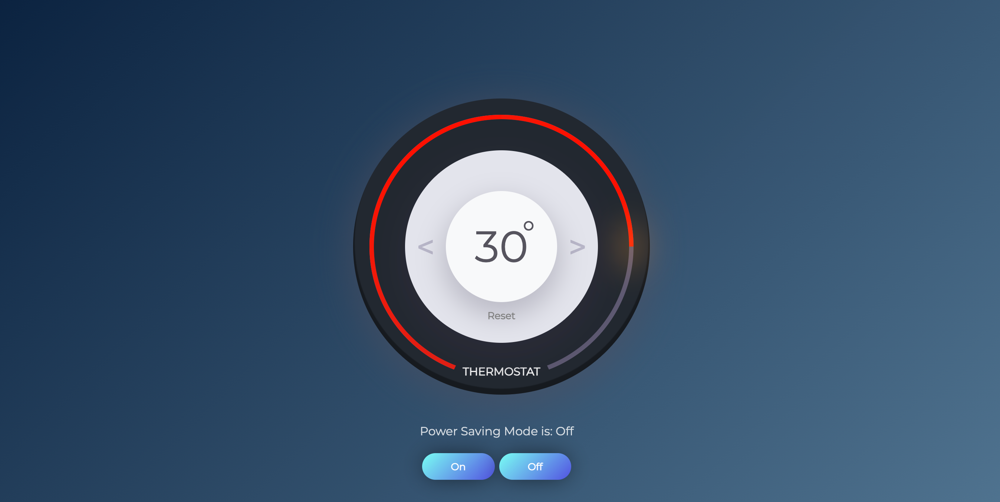

# Thermostat App

[](https://www.codefactor.io/repository/github/jasonrowsell/thermostat/overview/main) [](https://travis-ci.com/jasonrowsell/thermostat) [](https://codecov.io/gh/jasonrowsell/thermostat) [](https://bettercodehub.com/)

**[Check it out here.](https://jasonrowsell-thermostat.herokuapp.com/)**

<!-- Table of Contents -->

## Table of Contents

- [Overview](#overview)
- [Live Demo](#live-demo)
  - [Screenshots](#screenshots)
- [Getting Started](#getting-started)
  - [Development](#development)
  - [REPL](#repl)
- [Spec](#spec)
  - [Requirements](#requirements)
- [Features](#features)
  - [Temperature Control](#temperature-control)
  - [Thermostat Color](#thermostat-color)
  - [Power Saving Mode](#power-saving-mode)
  - [Reset](#reset)
- [Design](#design)
  - [Testing](#testing)
  - [Test Coverage](#test-coverage)
  - [Technologies Used](#technologies-used)

<!-- Overview -->

## Overview

Thermostat app to regulate a household's temperature, with minimum and maximum limits to maintian a cost-effective energy plan. The program focuses on test driven development (TDD), prototypal behaviour and DOM manipulation.

<div align="center">

---

[Top](#table-of-contents)

---

</div>

<!-- Live Demo -->

## Live Demo

**[Check it out here.](https://jasonrowsell-thermostat.herokuapp.com/)** You can change and reset the temperature, as well as alter the status of Power Save.

### Screenshots






<div align="center">

---

[Top](#table-of-contents)

---

</div>

<!-- Getting Started -->

## Getting Started

### Development

To run locally:

Get a copy of the Thermostat app running on your local machine (for playing around, testing or development).

```sh
git clone git@github.com:jasonrowsell/thermostat
```

To install dependencies:

```shell
npm install
```

Run test suites with:

```shell
npm test
```

If not already installed, run the command:

```sh
npm install http-server -g
```

To run the localhost server:

```sh
http-server
```

Go to your browser and type localhost:8080 or go [here.](http://127.0.0.1:8080)

### REPL

For an interactive prompt that will allow you to experiment:

Run Node:

```shell
node
```

Once in Node:

```node
const thermostat = require './public/js/src/thermostat.js'
thermostat = new Thermostat
```

<strong>Usage</strong>

A demonstration of how to use the program in Node.

```node
> const thermostat = require './public/js/src/thermostat.js'

> thermostat = new Thermostat
Thermostat {
  DEFAULT_TEMPERATURE: 20,
  MIN_TEMPERATURE: 10,
  MAX_ON_TEMPERATURE: 25,
  MAX_OFF_TEMPERATURE: 32,
  MEDIUM_USAGE_LIMIT: 18,
  HIGH_USAGE_LIMIT: 25,
  _temperature: 20,
  _powerSavingMode: true
}

> thermostat._temperature
20

> thermostat.up()
> thermostat._temperature
21
```

<div align="center">

---

[Top](#table-of-contents)

---

</div>

<!-- Spec -->

## Spec

### Requirements

- Thermostat starts at 20 degrees
- You can increase the temperature with an up function
- You can decrease the temperature with a down function
- The minimum temperature is 10 degrees
- If power saving mode is on, the maximum temperature is 25 degrees
- If power saving mode is off, the maximum temperature is 32 degrees
- Power saving mode is on by default but it can also be turned off
- You can reset the temperature to 20 with a reset function
- You can ask about the thermostat's current energy usage: < 18 is low-usage, 25 - is medium-usage, anything else is high-usage.
- (In the challenges where we add an interface, low-usage will be indicated wi- green, medium-usage indicated with black, high-usage indicated with red.)

<div align="center">

---

[Top](#table-of-contents)

---

</div>

<!-- Features -->

## Features

### Temperature Control

On the thermostat are two buttons which control an increase and decrease in the household's temperature. The displayed temperature will dynamically change as a result of either button being clicked.

### Thermostat Color

As the temperature is changed by the user, the thermostat's colour will change dynamically to reflect the energy-cost status.

- Green: eco-friendly and saving costs.
- Amber: eco-friendly and average costs.
- Red: not eco-friendly and maximizing costs.

### Power Saving Mode

The household has the option to enable or disable Power Saving Mode. If this option is enabled, the household is limited to a maximum temperature of 25 degrees, in order to reduce energy costs. If this option is disabled, the maximum exceeds to 32 degrees.

### Reset

The household has the option to reset the temperature to a regulated standard of 20 degrees. This can be selected by clicking a single button.

<div align="center">

---

[Top](#table-of-contents)

---

</div>

<!-- Design -->

## Design

### Testing

Extensive testing and error checking was undertaken throughout the development process.

- [Test Coverage: 100%](#test-coverage), `jest --coverage`
- Testing covers and passes requirements
- Prominence on BDD (Behaviour Driven Development)
- Unit tests in isolation
- Red Green Refactor loop

### Test Coverage

Using Jest I was able to test if the code was working as expected. The test files can be found [here](public/js/__tests__).


### Technologies Used

- [HTML5](https://developer.mozilla.org/en-US/docs/Web/Guide/HTML/HTML5)
  - Used as the basis of the website.
- [CSS3](https://developer.mozilla.org/en-US/docs/Archive/CSS3)
  - Used for the overall look of the site and its elements.
- [Javascript](https://developer.mozilla.org/en-US/docs/Web/JavaScript)
  - Used to provide site functionality.
- [Jest](https://jestjs.io/)
  - Used for automated testing.

<div align="center">

---

[Top](#table-of-contents)

---

</div>
